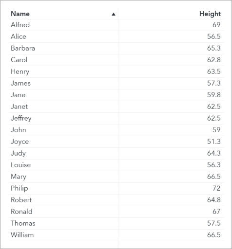
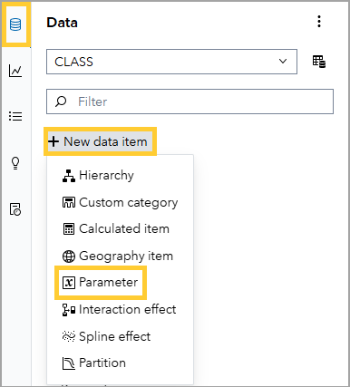
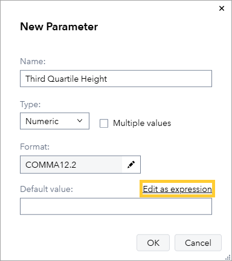
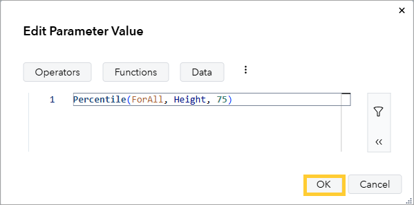
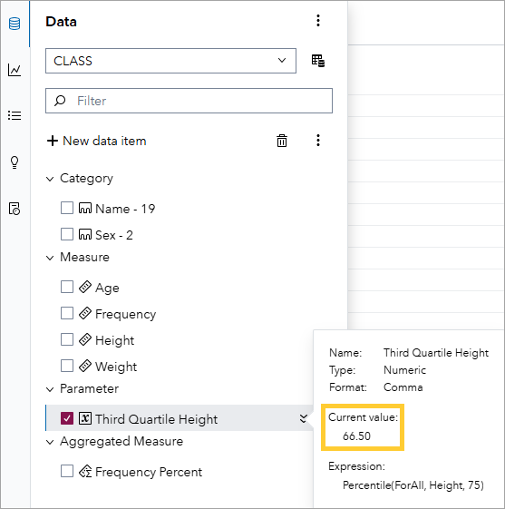
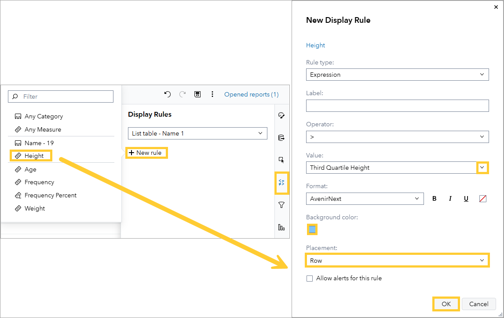
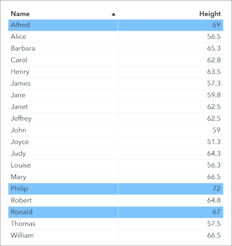

# Creating a Display Rule with a dynamic threshold

## Open the Report

1. In SAS Visual Analytics, create a new report.

1. On the left, click on the **Data** pane, and then on **Add data**. Add the **CLASS** table from the **HELPDATA** library.

1. View the list table. This is the input table. We have one line per student. There are two data items: the student name and their height (in inches).

    

    We want to highlight the students who are in the top 25% of height. In other words, the students with a height above the 75% percentile of height.

    ## Create an expression-based parameter

1. Create an expression-based parameter to calculate the threshold: the 75th percentile of height.

    1. In the **Data** pane, click on **New data item** and on **Parameter**.

        

    1. In the **New Parameter** dialog box enter the following:

        1. Name: **Third Quartile Height**

        1. Type: **Numeric**

        1. Ensure that the parameter accepts only a single value.

        1. For the Type, ensure **Numeric** is selected.

        1. Next to Default value, click on **Edit as expression**:

            

    1. Enter an expression to calculate the 75th percentile of height:

        1. Enter the following expression:

            ```sas
            Percentile(ForAll, Height, 75)
            ```

            

        1. Click **OK**.

    1. Verify the current value of the Third Quartile Height parameter:

        1. In the **Data** pane, hover over **Third Quartile Height**.

        1. Ensure the current value displayed is **66.50**.

            

    ## Apply the Parameter to a Display Rule

1. Create a display rule to highlight rows with a height above **Third Quartile Height** blue.

    1. Ensuring the list table is selected, click on the **Rules** pane on the right to define a new display rule.

    1. Select **New rule**.

    1. Click on **Height**.

    1. In the New Display rule window, enter the following values:

        1. For Rule Type, ensure that **Expression** is selected.

        1. Leave Label Empty.

        1. For Operator ensure that **>** (greater than) is selected.

        1. For Value: select **third Quartile Height**.

        1. Click **OK**.

        

1. Confirm that the tall students are highlighted in the list table.

    

1. Keep this report open, we will use it later.