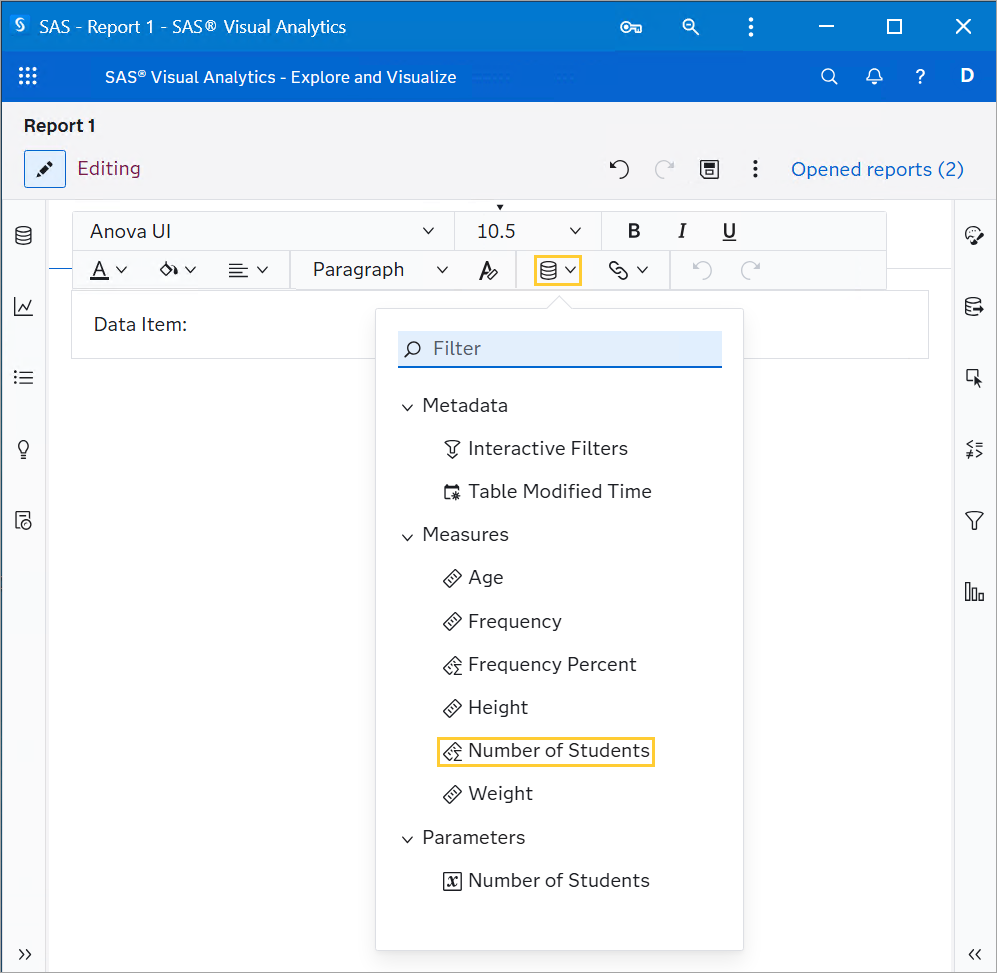
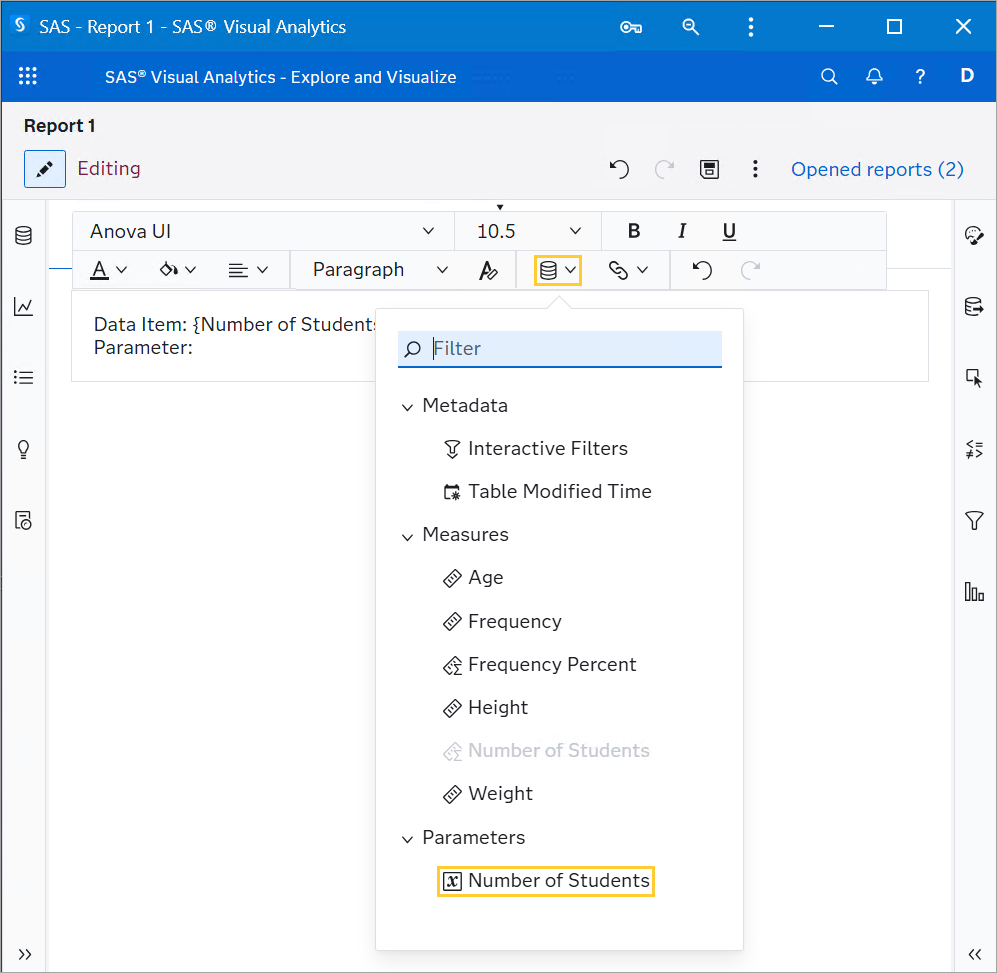
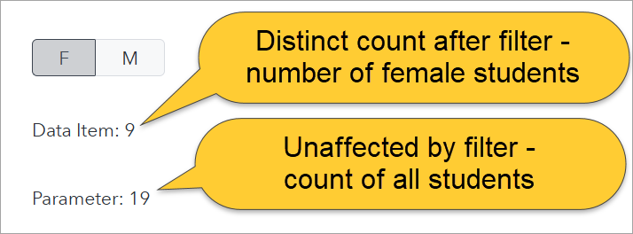

# Interlude: Parameters are not affected by Filters

In this demonstration, we will see that parameters are not affected by interactive or object filters.

## Open the Report

1. Open the 3_InterludeParametersNotAffectedByFilters report.

    ## Create a Calculated Data Item

1. In the **Data** pane, click on **New data item** and then **Calculated item**.

1. Enter the following values in the New Calculated Item window:

    1. Name: **Number of Students**

    1. Format: **F3.**

    1. For the expression, enter:

        ```sas
        Distinct(ForAll, Name)
        ```

    1. Click **OK**.

    ## Create an Expression-based Parameter for the Number of Students

1. In the **Data** pane, click on **New data item** and then **Calculated item**.

1. Enter the following values:

    1. Name: **Number of Students**

    1. Type: **Numeric**

    1. Format: **F3**

    1. For default value, click on edit as expression and enter the following expression:

        ```sas
        Distinct(ForAll, Name)
        ```

    1. Click **OK**.

    1. Click **OK**.

    ## Assign to Text object

1. From the **Objects** pane, drag the Text object to the canvas.

1. Double click the Text object to edit it.

1. Type **Data Item:** and then click on the **Data** icon in the floating menu. Then, click on the **Number of Students** data item. Alternatively, you can drag the data item onto the Text object from the **Data** pane.

    

1. Type **Parameter:** and then click on the **Data** icon in the floating menu. Then, click on the **Number of Students** parameter. Alternatively, you can drag the parameter onto the Text object from the **Data** pane.

    

    ## Add a page prompt

1. In the **Data** pane, right-click on the **Sex** column and click on **Add as a page control**.

    ## Apply Filter

1. In the page control, click on **F**. Note that in the Text object, the value of the data item changes as the filter is applied. Meanwhile, the parameter value (which has the same expression) is unaffected by the filter.

    
