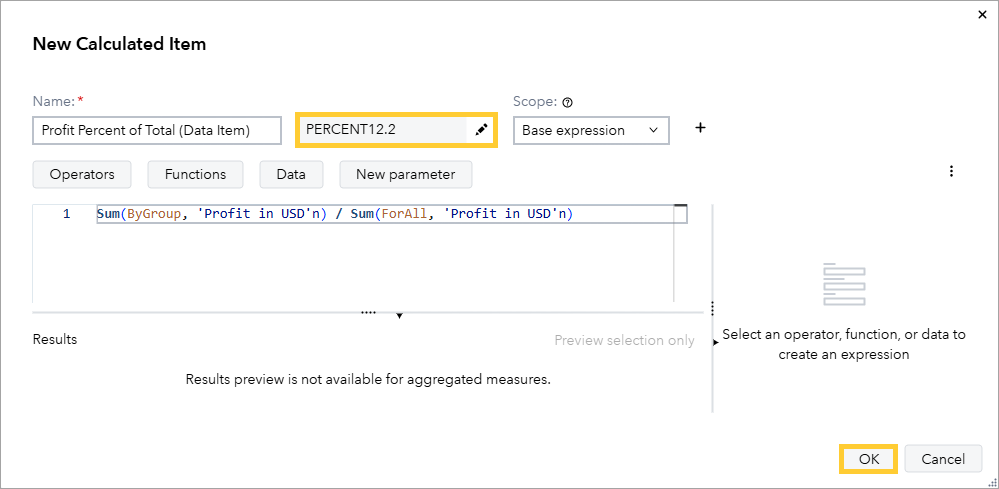
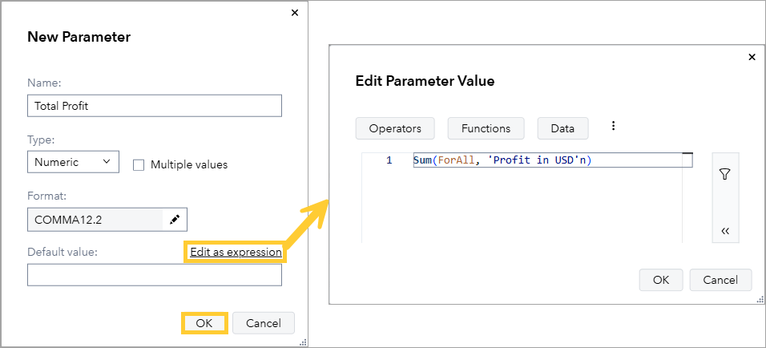
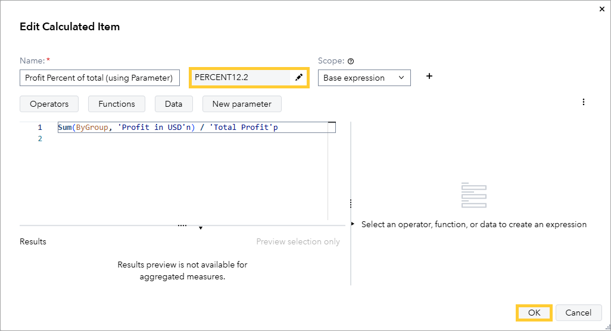
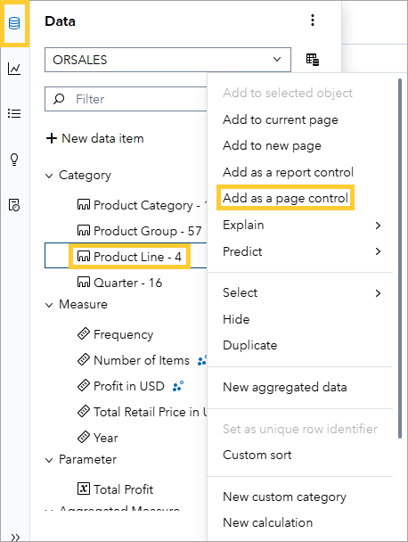
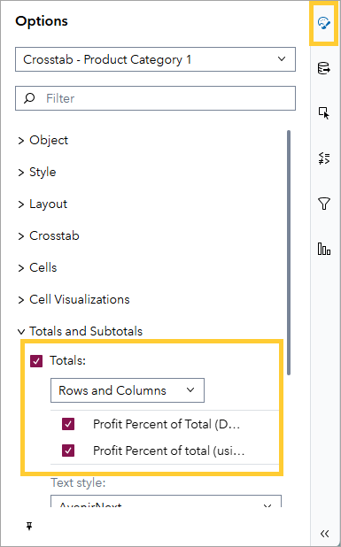
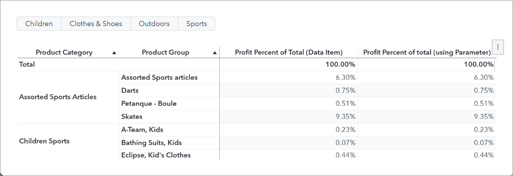
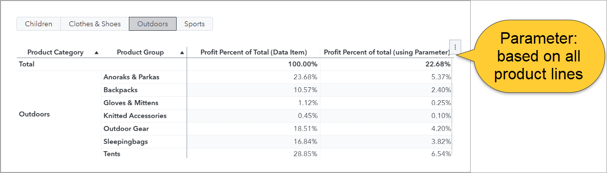

# Calculating a Percent of Total

In this demo, we will calculate the percent of a total that is unaffected by filters using an expression-based parameter.

1. Open the **4_PercentOfTotal** Report in SAS Visual Analytics. Ensure you are editing the report.

    ## Create a Data Item calculating the percent of Total Profit

1. In the **Data** pane, click on **New data item**.

1. Click on **Calculated item**.

1. Type in the following values:

    1. Name: **Profit Percent of Total (Data Item)**

    1. Format: **PERCENT12.2**

    1. For the expression, write:

        ```sas
        Sum(ByGroup, 'Profit in USD'n) / Sum(ForAll, 'Profit in USD'n)
        ```

    1. Click **OK**.

        

    ## Create a Parameter calculating the Total Profit

We will now calculate the percentage of total profit using a parameter. Note we cannot directly display a parameter in a list table (or many other objects). Therefore, We do this in two steps. Firstly, we create a parameter calculating the total profit. This will not be influenced by interactive or object filters. Secondly, we reference the Total Profit parameter in a new data item.

1. Create a parameter calculating the total profit.

    1. In the **Data** pane, click on **New data item** and Parameter.

    1. Enter the following values:

    1. Name: **Total Profit**

    1. Type: **Numeric**

    1. Ensure the parameter accepts single values.

    1. Next to default value, click on **Edit as expression**.

    1. Enter the following expression:

        ```sas
        Sum(ForAll, 'Profit in USD'n)
        ```

    1. Click **OK**.

    1. Click **OK**.

    

1. Create a data item calculating the percent of total profit, referencing the **Total Profit** parameter.

    1. In the **Data** pane, click on **New data item**.

    1. Click on **Calculated item**.

    1. Type in the following values:

        1. Name: **Profit Percent of Total (using Parameter)**

        1. Format: **PERCENT12.2**

        1. For the expression, write:

            ```sas
            Sum(ByGroup, 'Profit in USD'n) / 'Total Profit'p
            ```

            **Note:** if you substitute the expression of the Total Profit parameter into the expression of the Profit Percent of total (using Parameter) you get the same expression as Profit Percent of Total (Data Item). However, recall that parameters are unaffected by interactive and object filters. It will therefore be the Profit Percentage over all Product Lines – unaffected by any interactive or object filters.

        1. Click **OK**.

        

    ## Add an interactive filter

1. In the **Data** pane, right-click on **Product Line** and select **Add as page control**.

    

    ## Add a Crosstab

1. From the **Objects** pane, drag a Crosstab onto the canvas.

1. In the **Data Roles** pane, assign the following roles:

    1. Rows: **Product Category**, **Product Group**

    1. Measures: **Profit Percent of Total (Data Item)**, **Profit Percent of Total (using Parameter)**

1. In the **Options** pane, enable Totals for the Crosstab.

    

    ## View the Crosstab

1. Note without any interactive filters, both measures have the same values:

    

1. In the page control, select **Outdoors**. Note the measures do not display the same value anymore:

    

**Note:** the total for Profit Percent of total (using Parameter) is 22.68% - illustrating that the denominator of the profit calculation is still over all product lines – unaffected by the page control. In other words, the Outdoors product category accounts for 22.68% of total profit across all product lines – which Profit Percent of total (using Parameter) correctly reflects. Therefore, if you want your percent of total calculation to be unaffected by object or interactive filters, create a parameter for the denominator of the percent of total calculation!
